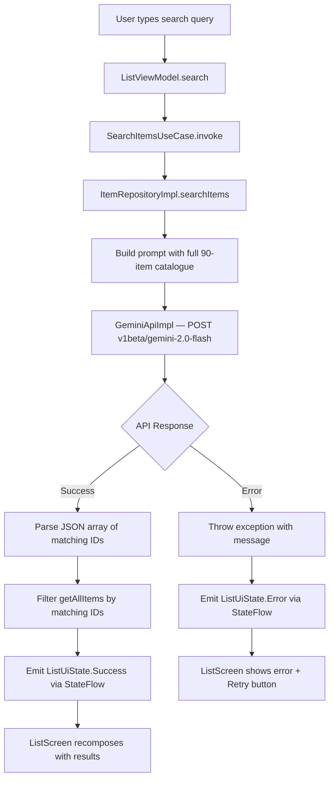
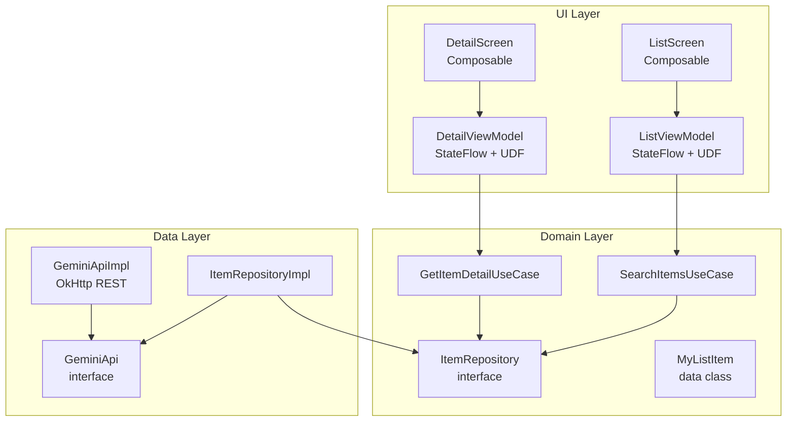

# MySampleApplication — AI Natural Language Search

[](https://github.com/lakshmanreddymv-bot/MySampleApplication-AI/actions/workflows/ci.yml)


> Search 90 catalogue items using plain English. Powered by Gemini 2.0 Flash — no keyword matching, just intent.

---

## Problem Statement

Traditional list screens force users to scroll or rely on exact keyword matches. A user searching for *"something to eat in Italy"* gets nothing from a `contains()` filter on "Pizza Margherita" or "Pasta Carbonara" — even though those are exact answers.

This project solves that by routing every search through Gemini 2.0 Flash, which understands intent and returns semantically matching results. It is **Project 1 of 4** in an AI-powered Android portfolio, establishing the foundational architecture pattern used across all four projects.

---

## Features

| Feature | Description |
|---------|-------------|
| Natural language search | Type anything — "Japanese street food", "something for cardio", "European capital" — and get matching results |
| Gemini 2.0 Flash integration | Real-time AI search via the Gemini v1beta REST API using OkHttp |
| AI-generated item detail | Tap any item to get a 2–3 sentence AI-written description |
| Loading overlay | Semi-transparent overlay with spinner and status label during AI calls |
| Error handling & retry | Descriptive error messages with one-tap retry on both screens |
| Clean Architecture + MVVM + UDF | Domain/data/UI layers with sealed state classes and StateFlow |

---

## How It Works



---

## Architecture



**Layer rules:**
- **Domain** — pure Kotlin, zero Android or framework imports. Defines `MyListItem`, `ItemRepository` interface, and both use cases.
- **Data** — implements domain interfaces. `ItemRepositoryImpl` holds the catalogue and bridges to `GeminiApiImpl`.
- **UI** — Jetpack Compose screens observe ViewModels via `StateFlow`. All user events call ViewModel functions (UDF).

**SOLID principles applied:**
- **S** — each class has one job (e.g., `SearchItemsUseCase` only handles search logic)
- **O** — new item categories can be added to `getAllItems()` without touching search logic
- **D** — all cross-layer dependencies point at interfaces (`ItemRepository`, `GeminiApi`), never concrete classes

**UDF pattern (every ViewModel):**
- Events flow **UP** from UI → ViewModel public functions
- State flows **DOWN** from ViewModel → UI via `StateFlow`
- UI never mutates state directly

---

## Tech Stack

| Layer | Technology | Version |
|-------|-----------|---------|
| Language | Kotlin | 2.0.21 |
| UI | Jetpack Compose + Material3 | BOM 2024.09 |
| Architecture | MVVM + Clean Architecture + UDF | — |
| AI | Gemini 2.0 Flash REST API | v1beta |
| Networking | OkHttp | 4.12.0 |
| Async | Kotlin Coroutines + StateFlow | — |
| Navigation | Navigation Compose | 2.8.9 |
| Testing | JUnit 4 + MockK + Coroutines Test | — |
| CI | GitHub Actions | — |
| Min SDK | Android 7.0 (API 24) | — |
| Target SDK | Android 15 (API 36) | — |

---

## Setup

### Prerequisites
- Android Studio Ladybug or newer
- A [Google AI Studio](https://aistudio.google.com/) API key (free tier is sufficient)

### Steps

```bash
# 1. Clone the repository
git clone https://github.com/lakshmanreddymv-bot/MySampleApplication-AI.git
cd MySampleApplication-AI

# 2. Add your Gemini API key to local.properties (NOT committed to git)
echo "gemini.api.key=YOUR_API_KEY_HERE" >> local.properties

# 3. Build and run
./gradlew assembleDebug
# Or open in Android Studio and press Run
```

> `local.properties` is in `.gitignore`. Your API key will never be committed.

---

## Unit Tests

38 tests across 6 test classes. Run with:

```bash
./gradlew :app:testDebugUnitTest
```

| Test Class | Tests | What Is Verified |
|------------|-------|-----------------|
| `SearchItemsUseCaseTest` | 5 | Delegates to repository, returns items, empty results, error propagation, query passthrough |
| `GetItemDetailUseCaseTest` | 3 | Delegates to repository, returns description, propagates exceptions |
| `ListViewModelTest` | 9 | Initial state, query updates, blank query clears, Loading→Success, Loading→Error, clear reset |
| `DetailViewModelTest` | 5 | Initial state, invalid ID→Error, valid ID→Success, correct item name, error with item |
| `ItemRepositoryImplTest` | 10 | 90-item count, first/last item, sequential IDs, JSON parsing, empty array, markdown stripping, prompt construction |
| `GeminiApiImplTest` | 5 | Valid response parsed, error object throws, missing candidates throws, empty body throws, POST request body |
| **Total** | **38** | |

---

## Known Issues & Bugs Fixed

| Issue | Root Cause | Fix |
|-------|-----------|-----|
| `android.util.Log` not available in unit tests | Android stub throws "not mocked" | Removed `Log.d` from `GeminiApiImpl` — debug logging has no place in a data class |
| `org.json` stubs throw in unit tests | Android SDK unit test stubs for `JSONObject`/`JSONArray` | Added `org.json:json:20231013` as `testImplementation` |
| URL construction broke MockWebServer tests | Missing `/` after `trimEnd('/')` gave `"65301models"` as port | Fixed to `"${base.trimEnd('/')}/models/..."` |

---

## Portfolio

| # | Project | AI Technology | Tests | Highlights |
|---|---------|--------------|-------|------------|
| 1 | [MySampleApplication-AI](https://github.com/lakshmanreddymv-bot/MySampleApplication-AI) | Gemini 2.0 Flash (REST) | 38 | Natural language search, Clean Architecture foundation |
| 2 | [FakeProductDetector](https://github.com/lakshmanreddymv-bot/FakeProductDetector) | Gemini Vision + Claude API | 46 | Image analysis, multi-model AI, barcode scanning |
| 3 | [EnterpriseDocumentRedactor](https://github.com/lakshmanreddymv-bot/EnterpriseDocumentRedactor) | ML Kit on-device | 0 API cost | Zero-cost PII redaction, fully on-device inference |
| 4 | [MedicalSymptomPreScreener](https://github.com/lakshmanreddymv-bot/MedicalSymptomPreScreener) | Gemini + safety layers | 67 | 3-layer safety, medical disclaimer, CI badge |

Each project builds on the same Clean Architecture + MVVM + UDF foundation established here.

---

## Tech Stack & AI Integration

**AI Layer:**
- **Gemini API** — Google's multimodal LLM used for natural language 
  understanding and intelligent response generation
- **LLM Integration** — REST API calls to large language models 
  using Retrofit + OkHttp, handling streaming responses, 
  error states and rate limiting
- **AI-powered Android features** — on-device intelligence 
  via ML Kit + cloud inference via Gemini API

**Developer Tooling:**
- **MCP (Model Context Protocol)** — open standard that connects 
  AI assistants directly to IDEs, enabling Claude Desktop to 
  read, write and refactor code inside Android Studio in real time

## Author

**Lakshmana Reddy**
Android Tech Lead · 12 years experience · Pleasanton, CA

[](https://github.com/lakshmanreddymv-bot)
[](mailto:lakshmanreddymv@gmail.com)
